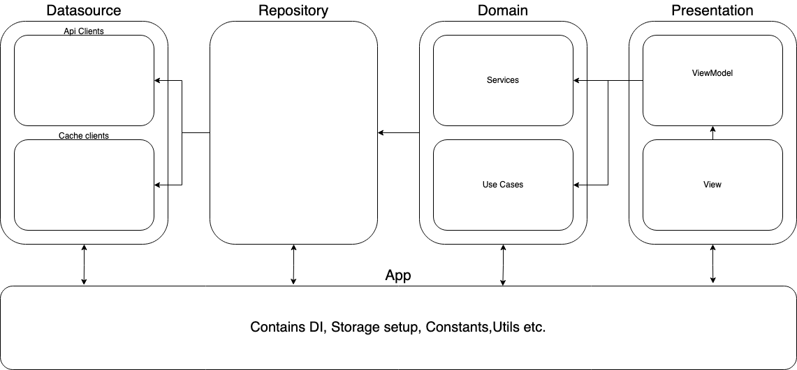

# Flutter template

Modular Template Flutter project using provider, following the given architecture:
Data <- Domain <- Presentation

 

 

## Used Packages
get_it - Dependency injection  
provider - State management  
dio - Api client  
hive & flutter_secure_storage - Cache client  
intl - Localizations  

This project is a starting point for a Flutter application with clean architecture.
